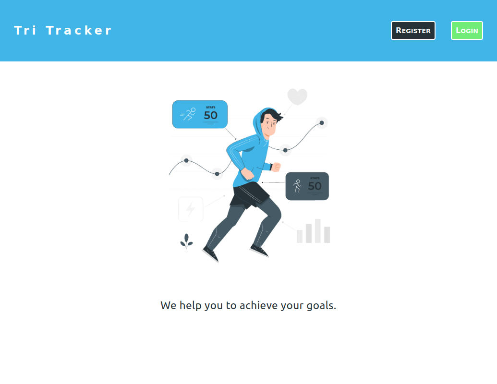
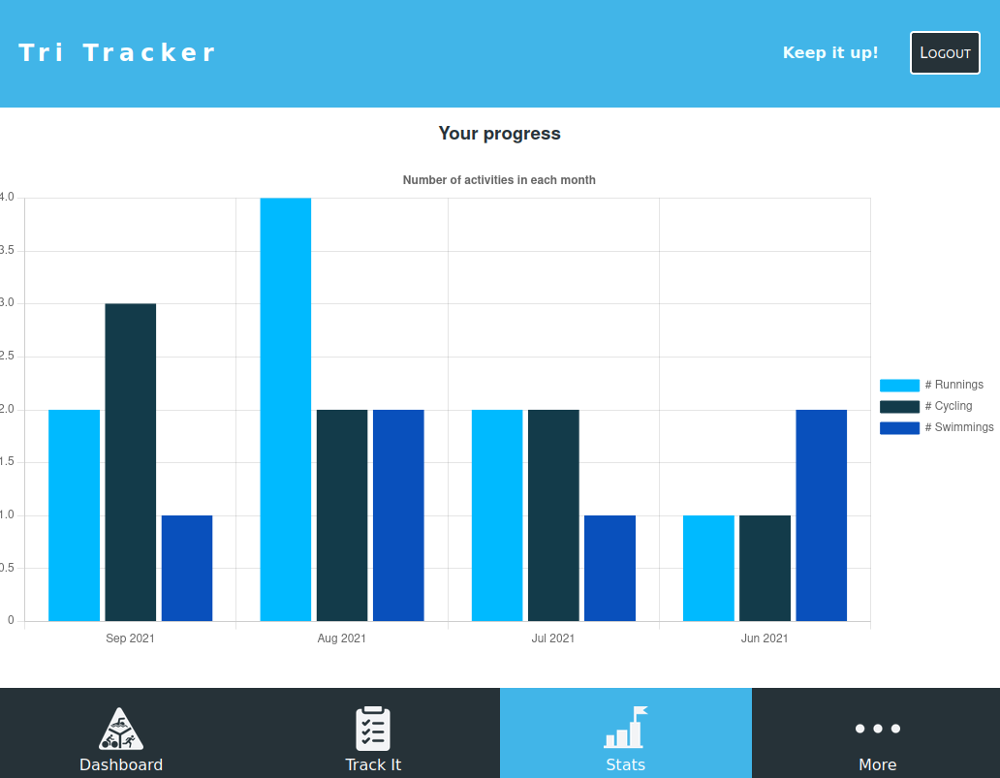

<h3 align="center">

  **TRI TRACKER**

</h3>

<p align="center">
  <strong>Web App created by Thales Neves</strong>
  <br>
  Project created using <a href="https://reactjs.org">React</a> & <a href="http://redux.js.org">Redux</a>
</p>

<p align="center">
  <a href="https://tri-tracker.herokuapp.com/">
    
  </a>
</p>

<p align="center">
  <a href="https://github.com/thneves/tri-tracker-client/issues">
    
  </a>
   ‎ ‎ ‎ ‎
  <a href="https://github.com/thneves/tri-tracker-client/issues">
    
  </a>
</p>

## Table of Contents
- [🚀 About Tri Tracker](#🚀-about-tri-tracker)
- [⚒️ Built With React & Redux](#⚒️-built-with-react-&-redux)
- [🟢 Live Demo](#🟢-live-demo)
- [🖥️ Setup](#🖥️-setup)
  - [Requirements](#requirements)
  - [Installation](#installation)
  - [API KEYS](#api-keys-and-env-variables)
  - [Run The Project](#run-the-project)
  - [Tests](#testing-code)
- [👤 Author](#👤-author)
- [🤝 Contributing](#🤝-contributing)
- [⭐ Show your support](#⭐-show-your-support)


## 🚀 About Tri Tracker

[**Tri Tracker**](https://tri-tracker.herokuapp.com/) is a web app where you can track your triathlon activities, you can record running, cyclings or swimmings. All your activities will be recorded and you can check the distance, moving time and average pace at any time. You can also check your stats and verify which activities you are doing most on each month through a graphic chart. It was build with React & Redux and [Rails API](https://github.com/thneves/triathlon-tracker).

<br>

## 🧪 Built With

[React](https://reactjs.org)

[Redux](http://redux.js.org)

[Chart Js](https://github.com/reactchartjs/react-chartjs-2)

[Heroku](https://netlify.com)

[Axios](https://axios-http)

[Jest](https://jestjs.io/)

<br>

## 🟢 Live

<h3>

  [Tri Tracker](https://tri-tracker.herokuapp.com/)

</h3>

<a href="https://tri-tracker.herokuapp.com/">
  
</a>

<br>

<a href="https://tri-tracker.herokuapp.com/">
  
</a>

<br>
<br>
<br>

## 🖥️ Setup

### Requirements

Internet Browser

[Git](https://git-scm.com/downloads) for version control.

[Node.js](https://nodejs.org) to install dependencies

[Yarn](https://yarnpkg.com) to run scripts and install packages.

### Installation

Open the terminal inside a folder of your choice and clone this repository using the following [Git](https://git-scm.com/downloads) commands in the terminal:

```
    git clone https://github.com/thneves/tri-tracker-client.git
```

Then, enter the project folder using:

```
    cd tri-tracker-client
```

To be able to run the web app you need to install Node dependencies by typing the following command on your terminal:

```
    yarn install
```

Done!

### Run The Project

Before running this project you must start the backend server, follow the instructions [HERE](https://github.com/thneves/triathlon-tracker)!
Make sure that your server is runnig on `localhost:3001` and the go on.

Now that you've installed the repository and have the backend server running. Type the following to start the project:

```
    yarn start
```

This command will open a `localhost:3000` server where it will be running the web app, you can close the server using CTRL + C.


### Testing Code

To check all the test coverage made in the project application run the following command:

```
    yarn test
```


**Enjoy!**

## 👤 Author

 **Thales Neves**

- Github: [thneves](https://github.com/thneves)
- Twitter: [@tsneves11](https://twitter.com/tsneves11)
- LinkedIn: [Thales Neves]([(https://www.linkedin.com/in/thales-neves10/))

## 🤝 Contributing

Contributions, issues, and feature requests are welcome!

Feel free to check the [issues page](https://github.com/thneves/tri-tracker-client).

## ⭐ Show your support

Give a ⭐️ if you like this project!

## Acknowledgments

The design idea of this project was made by [Gregoire Vella](https://www.behance.net/gregoirevella).